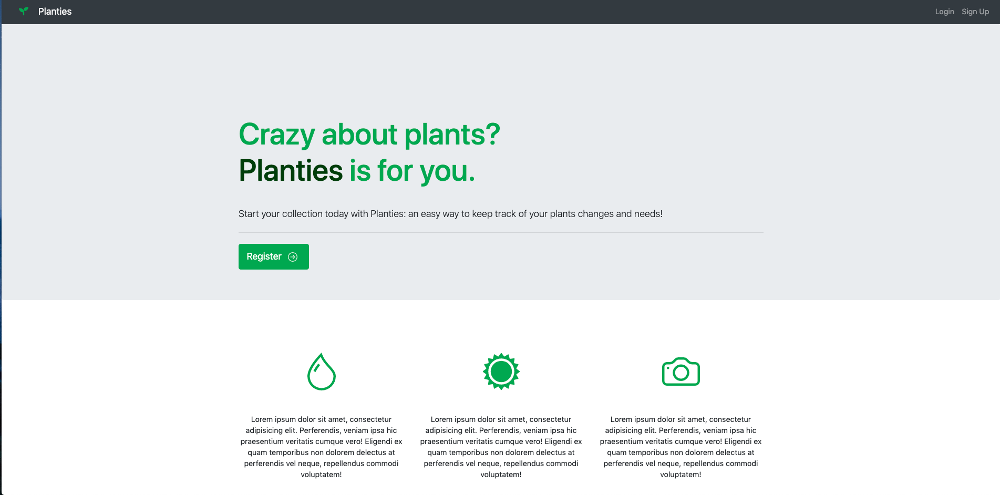
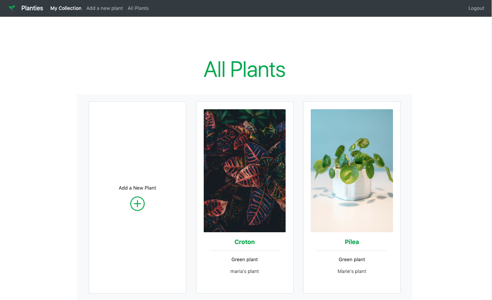
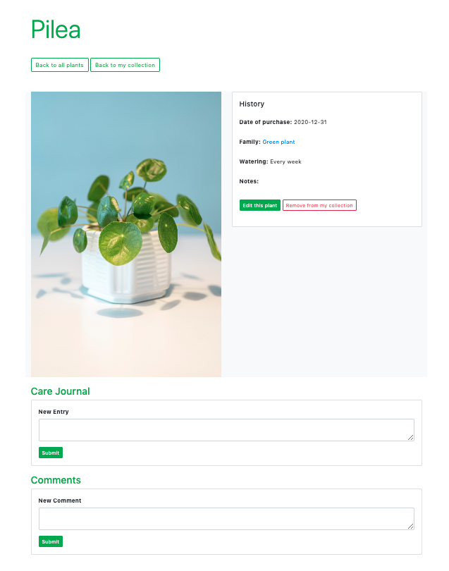
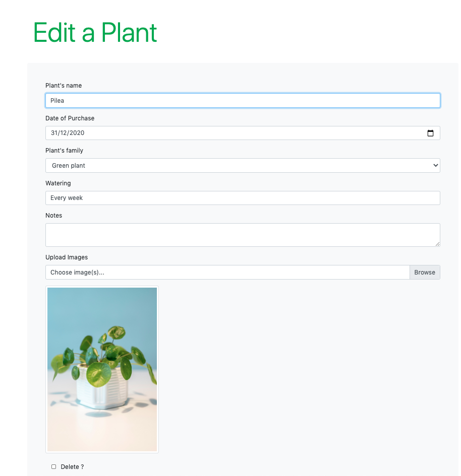
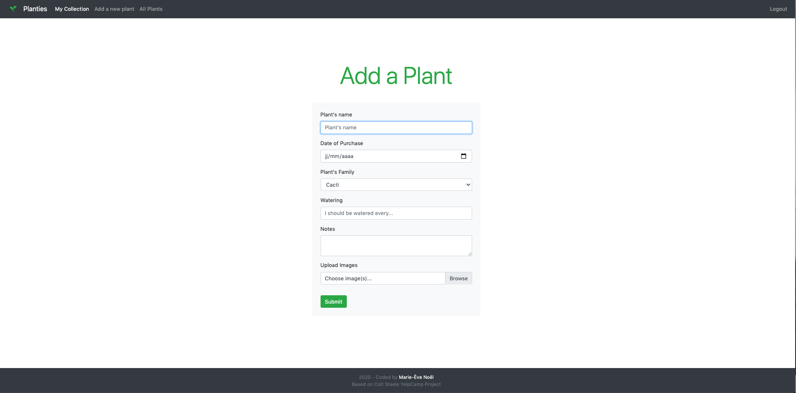

# Planties
Planties is a full-stack, RESTful Web app to collect and share your plants with other plant lovers!
It is based on Colt Steele's Web Developer Bootcamp final project (Yelpcamp). Throught this project, I learned to make a full fledged application with CRUD functionalities using a database, REST APIS, Authentication & Authorization.

## Design

### Home Page


### All plants


### Plant details


### Edit a Plant


### Add a plant


## Technologies
* HTML
* CSS
* Bootstrap
* Javascript
* Express
* Node.js
* EJS Templating
* Sessions
* MongoDB
* Mongoose
* Sanitizing HTML


## Features

* Authentication
* Authorization
* Creating and deleting comments
* Creating a user profile
* Creating and deleting care entries


## Run it locally
1. Install mongodb
2. Create a cloudinary account to get an API key and secret code
3. git clone https://github.com/nonowelle/planties
4. cd planties
5. npm install
6. Create a .env file in the root of the project and add the following:
````
 * DATABASEURL=  '<url>'
 * API_KEY=  '<key>'
 * API_SECRET= '<secret>'
 ````
7. Run mongod in another terminal and node app.js in the terminal with the project.
8. Go to localhost:3000.


